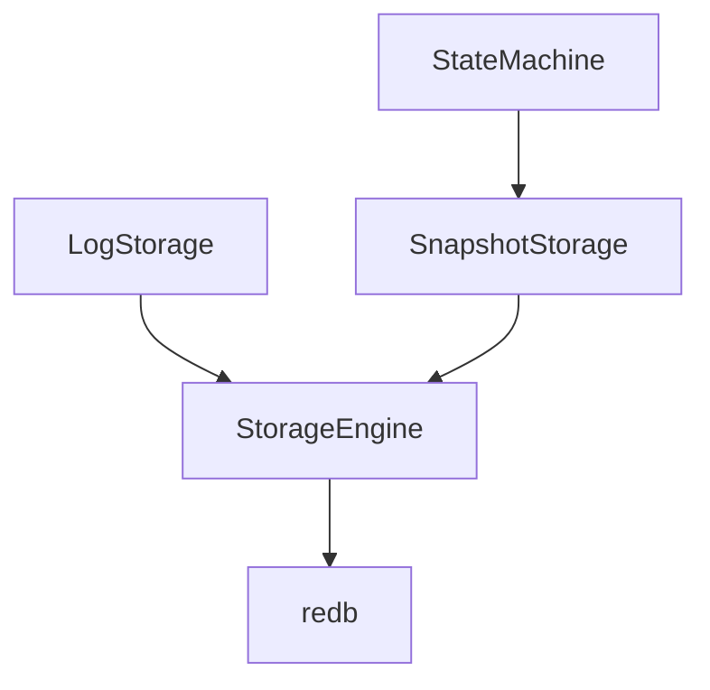

# Platoon

A distributed system to manage vehicle platooning, with distributed state machines based on the Raft protocol.

## Implementation

This system uses [`redb`](https://github.com/cberner/redb) as persistent storage engine.
It is an embeddable key-value store written in Rust.

The Raft protocol is implemented by [`openraft`](https://github.com/databendlabs/openraft/tree/main), based on the [`tokio`](https://github.com/tokio-rs/tokio) asynchronous runtime.

### Architecture

`LogStorage` provides an abstraction over the raw database for upper layers.
