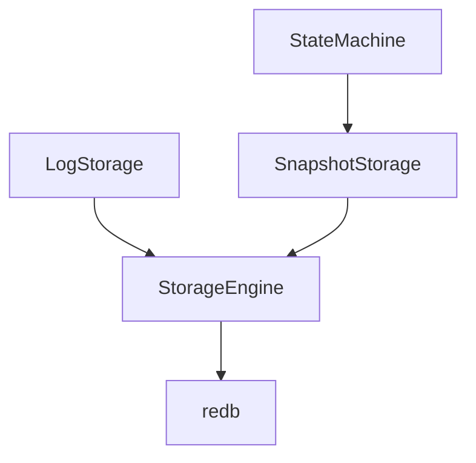

# Platoon

A distributed system to manage vehicle platooning, with distributed state machines based on the Raft protocol.

## Implementation

This system uses [`redb`](https://github.com/cberner/redb) as persistent storage engine.
It is an embeddable key-value store written in Rust.

The Raft protocol is implemented by [`openraft`](https://github.com/databendlabs/openraft/tree/main), based on the [`tokio`](https://github.com/tokio-rs/tokio) asynchronous runtime.

### Architecture



`LogStorage` provides an abstraction over the raw database for upper layers.

# Distributed Vehicle State Management Using Raft: A Proof of Concept

## 1. Introduction and Scope

This project implements a proof-of-concept distributed state management system for vehicle platooning using the Raft consensus algorithm. The system enables reliable state synchronization across multiple vehicles in a platoon, maintaining consistent vehicle positions, speeds, and heading information across the distributed network.

The implementation focuses on demonstrating how Raft can provide strong consistency guarantees for critical vehicle state data while handling node failures and network partitions. It serves as a foundation for exploring distributed consensus in vehicle-to-vehicle communication scenarios.

## 2. Software Architecture

### 2.1 Components and Dependencies

The system is built on several key components:

- **OpenRaft**: Core consensus implementation providing Raft protocol primitives
- **Tonic**: gRPC framework for network communication
- **ReDB**: Persistent key-value storage backend
- **Tokio**: Async runtime for concurrent operations

The architecture follows a modular design with clear separation between consensus logic, storage, networking, and application-specific state machine implementations.

### 2.2 Storage Engine

The storage subsystem implements a persistent log store using ReDB as the underlying database engine. Key features include:

- **Log Operations**: Atomic append, truncate, and purge operations on the distributed log
- **Snapshot Management**: Support for creating and restoring state machine snapshots
- **Vote Persistence**: Reliable storage of voting state for leader election
- **Transaction Safety**: ACID guarantees for all storage operations

The storage engine is abstracted behind traits, allowing different backend implementations while maintaining consistent behavior guarantees.

### 2.3 State Machine

The state machine implementation manages the application-specific vehicle state:

```rust
struct StateMachineData {
    state: BTreeMap<VehicleId, Vehicle>,
    membership: StoredMembership<NodeId, Node>,
    last_applied: Option<LogId>,
}
```

Key features include:

- **Vehicle State**: Position, speed, and heading tracking for each vehicle
- **Membership Management**: Dynamic cluster membership changes
- **Snapshot Support**: State serialization for efficient node recovery
- **Atomic Updates**: Consistent application of state transitions

### 2.4 Networking and Public API

The system exposes two gRPC service interfaces:

1. **Raft Internal Protocol**:
   - AppendEntries RPC for log replication
   - Vote RPC for leader election
   - InstallSnapshot RPC for state transfer

2. **Public Vehicle Management API**:
   - UpdateVehicle: Modify vehicle state
   - DeleteVehicle: Remove vehicle from platoon
   - GetPlatoon: Retrieve current platoon state

The networking layer implements automatic request forwarding to the leader node and handles cluster topology changes.

## 3. Evaluation and Analysis

### Strengths

1. **Strong Consistency**: The Raft implementation ensures all nodes maintain consistent vehicle state
2. **Fault Tolerance**: The system continues operating despite node failures
3. **Recovery Support**: Snapshot and log replay mechanisms enable efficient node recovery
4. **Modular Design**: Clear separation of concerns enables component testing and replacement

### Limitations and Future Work

1. **Performance Optimization**: The current implementation prioritizes correctness over performance
2. **Network Efficiency**: Could benefit from batch processing and compression
3. **Security**: Authentication and authorization mechanisms needed for production use
4. **Scalability Testing**: Further evaluation needed for larger platoon sizes

### Testing Coverage

The implementation includes comprehensive test suites covering:
- Storage engine operations
- State machine transitions
- Consensus protocol behavior
- Network protocol handling
